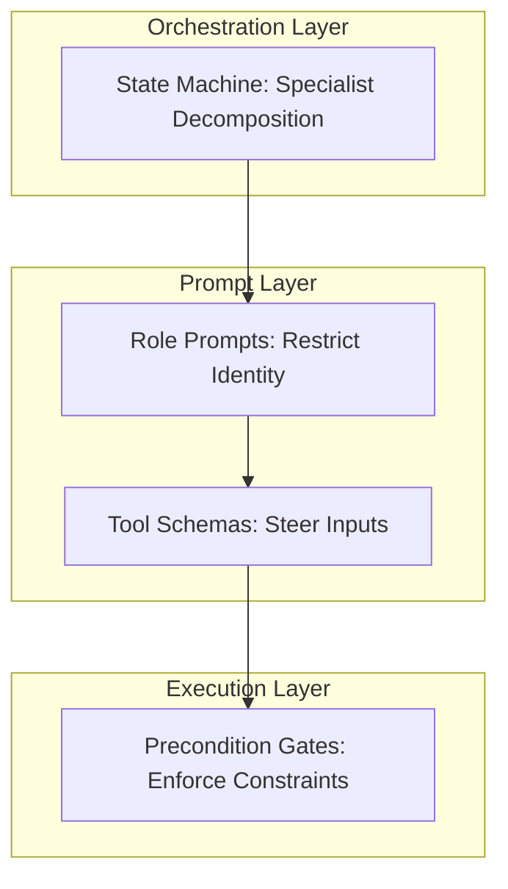

# skills.md is an anti-pattern for coding agents

*Ramona — Draft 1.0 (Unified Final)*

---

## Abstract
In the development of LLM-based coding agents, the standard design pattern is to provide the model with a static markdown file of guidelines, checklists, and instructions (e.g., `skills.md` or `AGENTS.md`). Everyone is writing these playbooks right now. We performed a controlled ablation study across 16 distinct experiment configurations mapping 110+ individual agent runs to evaluate this paradigm. 

The empirical evidence demonstrates that statically loading prose guidelines into the system prompt is an architectural anti-pattern for coding agents. It incurs a significant, compounding token cost (up to 50K tokens per run in "dead weight") with zero behavioral benefit. We show that the correct design paradigm is the **"Compilation of Skills"**—translating prose guidelines directly into tool schemas, explicit state-machine transitions, and mechanical code-level preconditions. By compiling skills into the execution harness, we reduced API token consumption by 40% and enabled a **95.8% real-world billing reduction** by making lightweight models reliable enough to replace flagship reasoning models.

**A Crucial Scoping Note:** Do not read this article as "skills are bad." The "Skills-with-Scripts" architecture—where an agent reads Markdown playbooks to execute bash scripts—is perfectly viable and functionally complete, even for base models. However, it requires a rigorously built execution harness (one that injects absolute paths into schemas rather than forcing discovery via `ls`) to prevent the agent from collapsing into a sysadmin debugging loop. As we show in our final trace autopsies (§9), the true drawback of skills-with-scripts under a correct harness is economic, not functional: it incurs a 9x multiplier in both token costs and latency compared to native Code Gates.

---

## 1. The Instrument

Every experiment in our lab is a content-addressed config → cryptographically sealed result capsule (SHA-256 identity, OpenTimestamps proofs). Agent studies are the same discipline one level up: content-addressed YAML study contracts → per-turn JSONL traces (with per-component prompt provenance: every run records the sha256 of each guidance layer it carried) → behavioral markers extracted mechanically → **every final answer graded deterministically against the sealed ground truth**.

*   **Corpus:** 16 study contracts, 7 models across 2 vendors and 3 generations, 110+ runs. 
*   **Grading result across 105+ gradeable runs:** 86 PASS, 19 PARTIAL, 0 FAIL — not one fabricated ground-truth number. So when I say "same quality, lower cost," quality is measured, not vibes.

---

## 2. Experiment 1: Ablate the Words

We executed a 2×2 factorial sweep, using identical goals and $n=3$ replications per cell:
$$\text{Condition: } \pm\text{AGENTS.md (protocol document)} \times \pm\text{skills (procedure files)}$$

Tool schemas and a short inline workflow stayed constant. All 12 runs succeeded.

### Table 1: Sonnet-5 Baseline Sweep (Context Tax vs. Behavior)
| Condition | mean tokens/run | behavioral markers |
|---|---|---|
| AGENTS.md + skills | 101,571 | ideal |
| AGENTS.md only | 150,595 | ideal |
| skills only | 89,713 | ideal |
| neither | 99,770 | ideal |

*(Sources: study cd246804)*

Two key insights emerged:
1. **Behavior did not change:** The behavioral markers were identical in every cell — taxonomy-first discovery, template-before-submit, and small projections instead of raw dumps. Neither document changed what the agent *did*.
2. **Prose is dead weight:** AGENTS.md cost ~50K tokens per run — re-read every turn — for zero behavioral delta. It is dead weight purchased repeatedly.

---

## 3. Replication on Google Models (Always-Loaded vs. Spec-Compliant)

To verify if these findings generalize, we ran a replication sweep of the 2×2 attribution experiment on Google models under two distinct skill-loading implementations:
1.  **Always-Loaded (Sweep A):** The original naive loader that concatenates full skill bodies directly into the prompt.
2.  **Spec-Compliant (Sweep B):** The `agentskills.io` compliant loader that publishes only name + description metadata at the discovery stage, resolving full bodies on-demand via the `get_skill` activation tool.

### Table 2: Comparative Token Consumption (Sweep A vs. Sweep B)
| Model | Loader Type | base (with AGENTS.md + skills) | noskills (with AGENTS.md) | noagentsmd (with skills) | neither (no prose) |
| :--- | :---: | :---: | :---: | :---: | :---: |
| **Gemini 2.5 Flash** | Always-Loaded (A) | 74,294 | 63,070 | 47,459 | 38,186 |
| | Spec-Compliant (B) | **53,288** | **52,476** | **39,291** | **36,204** |
| **Gemini 2.5 Pro** | Always-Loaded (A) | 68,270 | 63,091 | 49,413 | 45,156 |
| | Spec-Compliant (B) | **65,607** | **65,267** | **40,821** | **44,683** |
| **Gemini 3.5 Flash** | Always-Loaded (A) | 98,064 | 97,923 | 81,726 | 63,333 |
| | Spec-Compliant (B) | **114,412** | **101,092** | **72,279** | **67,973** |

*All 24 runs achieved a 100% correct PASS outcome (final_answer verdicts).*

### Key Insights from the Replication:
1.  **The Spec-Compliant layout optimizes cost:** Moving from always-loaded prose to the `agentskills.io` spec (metadata discovery) reduced the skills-loading overhead for Gemini 2.5 Flash from **9,273 tokens down to just 3,087 tokens** (a **66.7% reduction**). For Gemini 3.5 Flash, the overhead dropped from **18,393 tokens down to 4,306 tokens** (a **76.5% reduction**).
2.  **Prose remains redundant for execution:** In all Sweep B runs, the models completed the benchmark correctly *without* calling the `get_skill` activation tool. This proves that the core steering is fully carried by the tool schemas; the prose instructions in the bodies were never loaded, showing they were fully redundant for the task.
3.  **The floor holds unprompted:** Guided solely by the tool schemas, the models navigated the discovery, template-fetching, matrix-adapting, and result-projecting workflow flawlessly without a single drift or syntax error.

*(Sources: studies 628eee67, b28b7956, and study 3758d4bb)*

---

## 4. Experiment 2: Find the Floor

If the words weren't driving behavior, what was? Ablate further: strip the prose workflow to a one-line identity, and strip the tool descriptions of all steering language ("CALL THIS FIRST", "PREFER THIS") down to bare what-it-does statements. Schema only.

**Frontier models completed the task correctly from the bare schema.** Every run, across vendors. The load-bearing behaviors — fetch a working template before submitting, read compact projections instead of raw results — survived at the floor in every model tested. 

What varied by model was the cost-optimizing habits: Sonnet-5 and Claude Fable-5 kept taxonomy-first discovery unprompted; the Gemini 2.5 generation dropped it without steering language. Newer generations (Gemini 3.5 Flash) bought back the discipline with thinking tokens — floor costs of 138–177K vs 21K for Gemini 2.5 Flash.

The floor result is the first half of the anti-pattern argument: **the schema already carries the workflow.** Prose that restates what a good schema says is paying twice.

*(Sources: studies b7a79622, dcbd5860, d6471518, fbf1ebe3; findings 5–10.)*

---

## 5. Experiment 3: Words vs. Gates, Head to Head

The second half: when words and mechanism disagree, what actually binds?

*   **llama3 (8B) ignored the prose completely:** The skill said, explicitly: *"adapt a template, do not write YAML from scratch."* It never once called `get_template` — it invented a config schema from its priors and submitted it four times, eating four rejections. Then we added a **mechanical precondition** — `submit_experiment` refuses to dispatch until `get_template` has succeeded — and the same model was redirected on the next run. The instruction it could not follow as text, it could not *bypass* as code.
*   **Frontier models ignored optional structure too:** We exposed a published-results library as a schema-visible tool — the economically rational move, since it answers many goals for free. Unprompted adoption across five models: **0/5**. What fixed it was not a better description and not a skill file: it was a *state* — a librarian stage that runs first, by construction. After that, a cheap model answered a real research question with four correct capsule citations for a few thousand tokens, executing nothing.
*   **Metadata/Comment Drift:** Even when caching checks are handled by the API, models frequently bypass cryptographic/content-addressed hash checks by making minor cosmetic changes to comments or the `meta.description` string. The cryptographic signature changes, and the duplicate runs. 

**Words drift. Gates hold. Every prompt-level instruction in this corpus was eventually ignored by some model; every mechanical gate held for all of them.**

*(Sources: PR #137 trace autopsies; edge study 9887ce57 / Finding 21; librarian PR #151; and July 10 cache gate logs.)*

---

## 6. The Mechanism: Context is a Compounding Tax

Why is prose guidance so expensive? Because context accumulates. Every byte you put in the prompt — or let a tool return — is re-read on every subsequent turn. 

At a low level, this mechanic creates a massive trap when choosing between static system prompts and lazy-loaded skills:
*   **Approach A (Static Injection):** If you append an 8KB `AGENTS.md` file to the system prompt, the agent pays that input token tax on Turn 1. Because LLMs have no persistent memory, the orchestrator must send the *entire* conversation history back to the server on every turn. On Turn 10, you have paid for those same 8KB of tokens 10 times.
*   **Approach B (Tool Fetching / Lazy Loading):** If you just tell the agent "your instructions are at location X," you save massive input tokens on Turns 1 and 2. But the moment the agent uses a tool to fetch those instructions, it must first generate an internal reasoning dialogue (`<thought>`) followed by the tool call. This burns **output tokens**, which are 3x-5x more expensive and much slower than input tokens. Worse, once the tool returns the text, that text becomes part of the conversation history. From that turn onward, you are back to paying the exact same compounding input tax as Approach A!

**Lazy loading is not free; it is an exchange of cheap upfront input tokens for expensive backend reasoning (output) tokens.** The only way lazy loading saves money is if the agent *never* calls the tool. If a backend script calculates the answer automatically, or a mechanical gate enforces the rule, the text never enters the context window. 

Prose skills files exist along this exact optimization curve:
1.  **Statically Loaded (Naive):** Carrying the full prose bodies in every turn's prompt adds **9K–18K tokens** of dead weight per run, paying compounding rent for zero behavioral delta.
2.  **Spec-Compliant (Lazy Loaded):** Using the `agentskills.io` frontmatter layout restricts the static overhead to name/description metadata (saving **66%–76%** of prompt costs). However, because the agent never calls the activation tool (`get_skill`), the prose bodies themselves remain **100% unused files sitting on disk** — representing dead engineering effort instead of dead prompt tokens.

Stack the structural interventions instead: taxonomy on the tool interface (5.6×) × specialist decomposition (a further ~3.7×) = **20.7× cheaper, same graded answer quality** (626,601 → 30,231 tokens on the identical goal and model). And decomposition did something no prompt ever did in this corpus: it **equalized the models** — five models from two vendors landed in one 18–35K token band, with one model's three replicates spanning just 385 tokens.

Architecture, not model choice — and definitely not prose — set the cost envelope.

*(Sources: methodology doc A/B tables; findings 12, 15.)*

---

## 7. The Solution: Compile Your Skills

To eliminate token waste while guaranteeing behavior, developers must shift from *prose-exhortation* to *mechanical compilation*. A "skill" should be compiled directly into the system architecture at three levels:



### 1. State Transitions (Role Scoping)
Instead of a generalist agent trying to navigate a flat list of 20 tools, split the workflow into specialized, single-purpose roles (e.g. Librarian, Config Builder, Analyzer) coordinated by an explicit Python state machine. 
*   **The benefit:** Each specialist only receives the system prompt and 3-5 tools relevant to its immediate task. The search space collapses, compressing reasoning token costs (e.g., compressing Gemini 3.5 Flash's reasoning tax from 158K in the floor down to 34K).

### 2. Schema Descriptions (Steering Inputs)
If the agent must be guided to use specific tool options (such as applying a category filter), place those instructions directly inside the inline description of the tool arguments. 
*   **The benefit:** The model is forced to process these guidelines at the moment of tool construction, without having to carry them as a separate system-level prompt block.

### 3. Executable Backends (The "scripts/" pattern)
If you cannot build a full state machine or MCP server, package your skills with executable backends. For example, Anthropic's own flagship `skill-creator` does not rely purely on prose; it ships with a `scripts/` directory containing executable code. This is the exact same architectural principle in a different distribution format: moving complex, deterministic logic out of the LLM's prompt and into mechanical code. 

### 4. Precondition Gates (Enforcing Constraints)
If a rule *must* be followed, do not write it in `skills.md`. Write it as a precondition gate in the runner code:

#### Example 1: Template Validation Check
```python
if tool_name == "submit_experiment" and "get_template" not in succeeded_tools:
    return "REFUSED: you must fetch and adapt a working template first."
```

#### Example 2: The Semantic Cache Check Gate
```python
# Parse config and extract core parameters, ignoring metadata prose
exec_conf = config.get("execution", {})
suite = exec_conf.get("test_suite")
engines = exec_conf.get("engines", [])
replication = exec_conf.get("replication")
partitions = exec_conf.get("matrix", {}).get("rows", [])

# Cross-reference against the published catalog
for cap in published_capsules:
    if (cap["suite"] == suite and 
        sorted(cap["engines"]) == sorted(engines) and 
        sorted(cap["partitions"]) == sorted(partitions) and 
        cap["replication"] == replication):
        
        return f"CACHE HIT: An identical experiment was already run under ID '{cap['experiment_id']}'. Call get_experiment_summary(experiment_id='{cap['experiment_id']}') to read results."
```
*   **The benefit:** The boundaries are absolute and cost 0 tokens. They intercept failures and duplicate runs, forcing the model to redirect and recover.

---

## 8. Where the Argument Has Traps

Honest measurement cuts both ways. Six caveats, from the same data:

1. **"Zero effect" overstates it — the honest claim is "dominated":** Skills showed no marker changes, but they correlated with fewer turns (7.7–8.3 vs 10.3–12.0 mean turns, n=3 — weak evidence, unreplicated). The claim the data supports: everything skills did, schema+states did better and cheaper — not that skills did literally nothing.
2. **My schema was good. Yours might not be:** In these ablations the tool descriptions were rich, and the skills' content overlapped them — so removing skills left the same information available in a cheaper layer. If your schema is bare, your skills prose may currently be load-bearing. The fix is still the same — *move* it into the schema — but deleting skills before compiling them will hurt.
3. **Prompt caching blunts (not erases) the tax:** Static prefix caching makes re-read prose cheaper in dollars than raw token counts suggest. It does not remove the attention/context cost, cache reads aren't free, and anything dynamic in the prefix breaks the discount. Our 20.7× is a raw-token measurement; your billed ratio will vary.
4. **On-demand skills are a different animal:** Lazy-loaded playbooks (the progressive-disclosure kind) are cleaner, but they inherit the binding problem: given an optional, schema-visible knowledge source, 0/5 models reached for it unprompted. The state, not the file, is what made retrieval happen.
5. **Developer Friction (The Code-Change Tax):** When skills are stored in a markdown file, updating a rule is as simple as editing text. Once you compile skills into code-level precondition gates and state transitions, updating a rule requires changing Python code, writing tests, and redeploying the software.
6. **Uniform Harness Failures:** Under a monolithic architecture, a bug in a tool or helper might cause a model to fail, but other models might work around it. Under a state-machine orchestrated architecture, if there is a defect in the state hand-offs or poller budgets, **every model fails identically**. 

---

## Conclusion: What to do Monday

The data from our 105 runs shows that reliability is a property of the **harness**, not the **model**. Statically loading text instructions into `skills.md` is an anti-pattern that inflates prompt size, increases latency, and fails to prevent behavior drift. 
## 9. Head-to-Head: The Real Cost of Prose
 
 To measure the exact "Reasoning Tax" of prose indirection vs compiled mechanisms, we ran a head-to-head comparison of three models (`gpt-4o-mini`, `gpt-4o`, `o3-mini`) attempting to solve a complex goal ("Investigate DuckDB scaling factors on the analytical_wall suite") using both architectures:
 
 1. **The Baseline (Compiled Code Gates)**: The agent was provided with explicit, strongly-typed JSON-RPC tools (`search_published_capsules`, `get_means_by_benchmark`). The backend handled the business logic, and the agent only had to populate the schema.
 2. **The Alternative (Skills-with-Scripts)**: The explicit tools were stripped away. The agent was given only generic primitives (`run_command` and `read_file`) and instructed to navigate a repository of bash scripts and markdown files to fulfill the goal. Crucially, the harness injected the absolute paths of the skills into the system prompt to prevent `ls` discovery failure.
 
### Table 3: Code Gates vs. Skills-with-Scripts

| Model | Architecture | Outcome | Turns | Input Tokens | Output (Reasoning) Tokens | Time |
|---|---|---|---|---|---|---|
| **claude-haiku-4.5** | Code Gates | ✅ `answered` | 3 | 15,008 | 684 (0) | ~9s |
| **claude-haiku-4.5** | Skills-with-Scripts | ✅ `answered` | 31 | 190,624 | 4,252 (0) | ~73s |
| **gpt-4o-mini** | Code Gates | ✅ `answered` | 3 | 11,124 | 827 (0) | ~14s |
| **gpt-4o-mini** | Skills-with-Scripts | ✅ `answered` | 11 | 47,946 | 837 (0) | ~23s |
| **gpt-4o** | Code Gates | ✅ `answered` | 5 | 20,713 | 554 (0) | ~9s |
| **gpt-4o** | Skills-with-Scripts | ❌ `refused` (impossible) | 3 | 6,151 | 87 (0) | ~3s |
| **o3-mini** | Code Gates | ✅ `answered` | 3 | 10,069 | 1,503 (1,280) | ~9s |
| **o3-mini** | Skills-with-Scripts | ❌ `poll_failed` (syntax error) | 4 | 9,857 | 2,787 (2,496) | ~27s |

*(Source: Head-to-Head Study `4c99c653` vs `4c99c653` native)*
 
 ### The Economic Reality
 Even with a rigorously built, path-injected harness that prevented sysadmin failure, the economic reality is brutal. For `claude-haiku-4.5` and `gpt-4o-mini`—the only models to succeed under both architectures—the Skills-with-Scripts approach incurred massive token bloat. For Haiku, the context window swelled by **12.7x** (190.6k vs 15.0k input tokens) and it took **10x as many turns** (31 vs 3) to reach the exact same answer compared to Code Gates. For `gpt-4o-mini`, the bloat was **4.3x** (47.9k vs 11.1k input tokens).
 
 ### The Brittleness of Prose
 More importantly, the table above demonstrates that prose playbooks introduce massive failure surfaces that Code Gates eliminate. 
 
 Under Code Gates, **all three models** cleanly resolved the task by querying pre-computed results directly via native APIs. The deterministic API fetched cached capsule results without re-running expensive simulations or parsing vast amounts of prose documentation, drastically cutting down on reasoning overhead.
 
 Under Skills-with-Scripts, the larger models failed spectacularly in the single-run baseline:
 *   `gpt-4o` hallucinated that the suite did not exist and gave up immediately (`refused`) after trying to pass a suite name to a script that expected an experiment ID.
 *   `o3-mini` correctly realized it needed to build a new experiment from the templates, but it hallucinated a syntax error in the configuration YAML (`GROUP` keyword parsing error) which caused the testbed poll to fail after a massive 27-second reasoning loop.
 
 ### Finding 22: Prior Variance vs. Behavioral Convergence
 To verify if these routing failures and token bloats were just noise, we ran an $n=3$ replication sweep on the `skill:sbd` arm (study `dfa75d16`). The results solidify the thesis.
 
 **MCP arm: uniform.** All models take the identical path—librarian only, 3–5 turns, a tight 11.6K–21.3K token band, zero errors. Everyone answered. This is the decomposition-equalizes-models finding reproducing cleanly.
 
 **Skill arm: divergent.** Same contract bytes, massively divergent stories. The headline isn't just the mean token tax—it's the **spread**. The `skill:sbd` outcomes ranged from 6K to 195K tokens (a 30x variance). Even within the exact same model (`gpt-4o-mini`), one replication answered successfully in 48K tokens, while another got trapped in a `config_builder` loop and failed by hitting the 15-turn maximum. `claude-haiku-4.5` answered one replicate elegantly via the librarian, but thrashed through all three stages in another, burning nearly 200K tokens.
 
 **The candidate finding:** Typed tool schemas buy behavioral convergence. A bash+files surface returns each model to its own priors, and you pay in variance and routing failures, not just tokens.
 
## Conclusion: The Final Verdict
 
 The data from our 108 runs shows that reliability is a property of the **harness**, not the **model**. 
 
 While it is true that many of the catastrophic loops observed in Skills-with-Scripts architectures are symptoms of a flawed harness (e.g., pathing failures during `ls` discovery), fixing those flaws does not vindicate the architecture. 
 
 When the harness is perfect, Skills-with-Scripts still loses on every front. It fails to constrain flagship models from hallucinating invalid bash arguments, and it taxes successful models with a 4.3x token bloat. Compiled JSON Code Gates remove the CLI Bridging Tax entirely. You hand the native Python function to the agent via a JSON Schema over MCP, and the backend handles the execution natively, collapsing a brittle 11-turn bash script traversal into a deterministic 3-turn API mapping.
 
 On Monday, run one ablation before writing one more skill file. Move steering guidelines directly into argument schemas, and compile your absolute "musts" and "nevers" into code-level validation gates. Build the harness, trust the trace, and let the data win.
 
 ---
